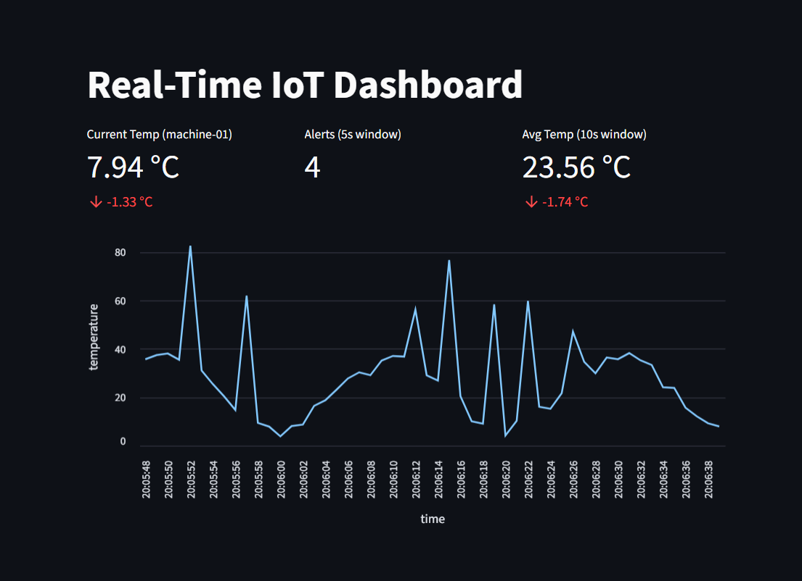

# Real-Time IoT Temperature Monitoring System

## Overview
This project is a real-time IoT temperature monitoring system built using Kafka, Quix Streams, and Streamlit. It demonstrates a streaming data pipeline that collects, processes, and visualizes temperature sensor data.

## Components

### 1. Producer (`producer.py`)
- Simulates a temperature sensor
- Generates random temperature readings
- Publishes sensor data to a Kafka topic every second

### 2. Consumer (`consumer.py`)
- Monitors sensor data
- Filters and generates alerts for high temperatures (> 30°C)
- Publishes alerts to a separate Kafka topic

### 3. Alert Counter (`alert_counter.py`)
- Counts the number of alerts in 5-second windows
- Publishes alert count statistics

### 4. Temperature Average (`temp_average.py`)
- Calculates average temperature over 10-second windows
- Publishes average temperature statistics

### 5. Dashboard (`dashboard.py`)
A Streamlit-based real-time dashboard that displays:
- Current temperature
- Temperature trend chart
- Alert count
- Average temperature

## Prerequisites
- Python 3.12
- Docker
- Docker Compose
- Required Python packages (see `pyproject.toml`)

## Running the Project
1. Start Kafka:
```bash
docker-compose up -d
```

2. Install dependencies:
```bash
pip install -r requirements.txt
```

3. Run components in separate terminals:
```bash
python producer.py
python consumer.py
python alert_counter.py
python temp_average.py
streamlit run dashboard.py
```

## Technologies
- Kafka
- Quix Streams
- Streamlit
- Python


The Real-Time IoT Dashboard is a Streamlit-based visualization tool that displays live temperature data from an IoT sensor, showing the current temperature of machine-01, the number of high-temperature alerts in a 5-second window, and the average temperature over a 10-second window. The line chart presents a time series of temperature readings, allowing users to track temperature fluctuations in real-time. By leveraging Kafka and Quix Streams, the dashboard provides a dynamic, continuously updated view of sensor data, enabling quick insights into temperature trends and potential anomalies.
